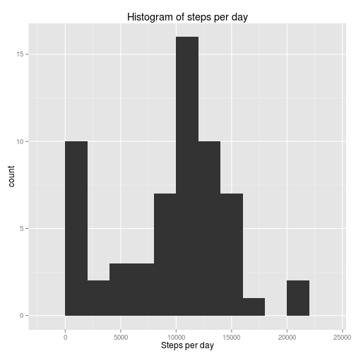
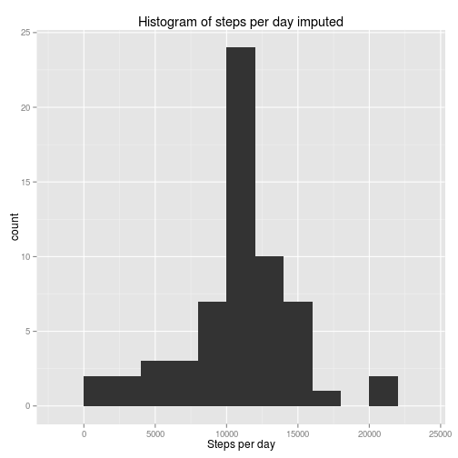
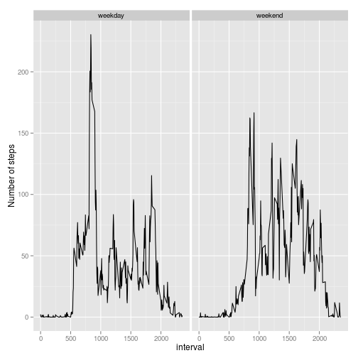

# Reproducible Research: Peer Assessment 1

## Loading and preprocessing the data
### First we read in the data


```r
activity <- read.csv('activity.csv')
```

## What is mean total number of steps taken per day?
### Next we create a histogram of the total number of steps taken each day

 

### Calculate and the mean and median total number of steps taken per day


```r
summary(stepsperday)[c(3,4)]
```

```
## Median   Mean 
##  10400   9350
```

## What is the average daily activity pattern?
### Now the time series plot of the daily activity pattern


```r
avgstepsperday <- tapply(activity$steps, activity$interval, mean, na.rm = TRUE)
plot(names(avgstepsperday),avgstepsperday, type = "l", xlab = "interval", ylab = "Average number of steps", 
    main = "time series of the interval and the average number of steps")
```

 

### Which 5-minute interval, on average across all the days in the dataset, contains the maximum number of steps?


The interval `835` has the maximum number of steps on average, namely `206.1698` number of steps.

## Imputing missing values
### The total number of missing values in the dataset


The total number of missings in the dataset is `2304`.

### Filling in all of the missing values in the dataset
We will replace the missing values with the average number of steps across all the days in the dataset.
At first we extract the rows with missing values and the rows with no missing values.
Then we replace the missings in the set with the rows with missing values. At last we unite the two sets,
the imputed set and the set without missings to start with. 


```r
avgsteps <- as.data.frame(cbind(avgstepsperday,as.integer(names(avgstepsperday))))
names(avgsteps) <- c("avg", "interval")
actmissings <- activity[is.na(activity[,1]),]
actnomissings <- activity[!is.na(activity[,1]),]
merged.data <- merge(actmissings, avgsteps, by="interval")[,c(-2)]
names(merged.data)[3] <- c("steps")
activity.imputed <- rbind(actnomissings, merged.data)
```

### Make a histogram of the total number of steps taken each day and Calculate and report the mean and median total number of steps taken per day


```r
stepsperday.imputed <- tapply(activity.imputed$steps, activity.imputed$date, sum, na.rm = TRUE)  
library(ggplot2)
qplot(stepsperday.imputed, xlab = "Steps per day", main = paste("Histogram of" , "steps per day imputed"), binwidth = 2000)
```

 

### Calculate and the mean and median total number of steps taken per day with the imputed data


```r
summary(stepsperday.imputed)[c(3,4)]
```

```
## Median   Mean 
##  10800  10800
```

Both estimates are higher on the imputed set. There tend to more missings on intervals with a high average number of steps. 

## Are there differences in activity patterns between weekdays and weekends?
### Create a new factor variable in the dataset with two levels - "weekday" and "weekend" indicating whether a given date is a weekday or weekend day.


```r
library(timeDate)
activity.imputed$weekend <- ifelse(isWeekend(strptime(activity.imputed$date,"%Y-%m-%d")),"weekend","weekday" )

avgstepsperweekendweekday <- tapply(activity.imputed$steps, list(activity.imputed$interval,activity.imputed$weekend) , mean, na.rm = TRUE)

avgstepsperweekday <- as.data.frame(cbind("weekday", avgstepsperweekendweekday[,1], rownames(avgstepsperweekendweekday)))
avgstepsperweekend <- as.data.frame(cbind("weekend", avgstepsperweekendweekday[,2], rownames(avgstepsperweekendweekday)))

avgstepsperweek <- rbind(avgstepsperweekday,avgstepsperweekend)
names(avgstepsperweek) <- c("weekend", "avg", "interval")
avgstepsperweek$avg <- as.numeric(as.character(avgstepsperweek$avg))
avgstepsperweek$interval <- as.numeric(as.character(avgstepsperweek$interval))
```

### Make a panel plot containing a time series plot of the 5-minute interval and the average number of steps taken, averaged across all weekday days or weekend days. 


```r
qplot(interval, avg,  data = avgstepsperweek, facets = .~weekend, geom = "line", ylab="Number of steps") 
```

 


